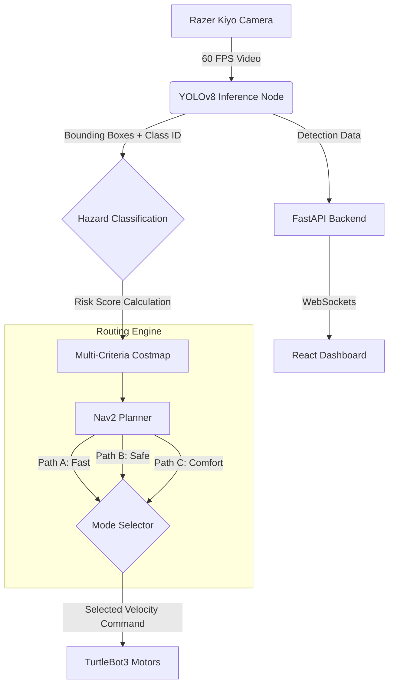

# Project Title: NavX

### Multi-Modal Autonomous Navigation System using Vision-First AI

-----

## 1. Executive Summary & Elevator Pitch

**The Problem:** In real life, drivers use apps like Waze/Google Maps to choose routes based on context: "Fastest," "Safest," or "Comfort." Current robots are limited to only finding the "Shortest Path," ignoring safety risks or payload stability.

**The Solution:** NavX is a full-stack robotics system that brings this human-level decision-making to autonomous agents. By using YOLOv8 for hazard perception and a multi-criteria routing engine, NavX dynamically recalculates paths to prioritize speed, safety, or stability based on real-time environmental data.

> Judge-Ready One-Liner: "NavX doesn't just move from A to B. It understands what is between A and B, calculating a specific Risk Score to choose the best path based on the user's need for Speed, Safety, or Comfort."

-----

## 2. Technical Specifications (The Stack)

### Hardware

- Robot Platform: TurtleBot3 Burger
- Vision Sensor: Razer Kiyo Camera (720p @ 60FPS) — High framerate is crucial for real-time inference.
- Compute Unit: Laptop (GPU-accelerated) running the Neural Network & ROS2 Core.
  - Note: The Laptop handles the heavy AI processing; the Raspberry Pi acts as the microcontroller interface.

### Software & Frameworks

- Robotics Middleware: ROS2 Humble + Nav2 Stack
- AI & Perception: YOLOv8 (Object Detection & Hazard Classification)
- Backend: Python + FastAPI (Real-time data streaming)
- Frontend: React.js + TailwindCSS (Dashboard & Control)
- Deployment: Vercel (Frontend) + Git/GitHub (CI/CD)

-----

## 3. System Architecture

The flow moves from Perception (Seeing) to Logic (Thinking) to Action (Moving).



-----

## 4. The Core Concept: Real World vs. NavX Simulation

This section explains how we translate "Big Tech" logic into a robotics demo.

| Feature | In Real Life (Google/Waze) | In NavX (Our Robot) |
| :--- | :--- | :--- |
| Data Source | Traffic APIs, Police Reports, Weather Satellites | YOLOv8 Computer Vision |
| Hazards | Car accidents, potholes, congestion | Cones, boxes, obstacles |
| Route Logic | Avoid red traffic zones | Avoid high "Hazard Density" zones |
| Updates | User reports (Crowdsourcing) | Real-time Camera Detection |

-----

## 5. Deep Dive: Perception & Hazard Classification

We utilize a Vision-First approach. Instead of relying solely on LiDAR (which sees geometry but not context), we use YOLOv8 to understand what the obstacles are.

### The Hazard Formula

We calculate a risk score for every object detected:

Risk = Σ (Confidence × Weight_Type × Penalty_Distance)

- Weight: A "Person" has a higher risk weight (1.0) than a "Box" (0.5).
- Proximity: We estimate distance using the bounding box size (Monocular Depth Estimation).
  - Larger Box = Closer = High Penalty (3×)
  - Smaller Box = Farther = Low Penalty (1×)

Design Defense (Q&A Prep):
- Judge: "Why not just use the LiDAR?"
- Answer: "LiDAR sees a wall, but it doesn't know if it's a concrete barrier or a velvet rope. By using Vision, we can assign semantic meaning to obstacles. This allows the robot to make smarter decisions—like passing close to a box but staying far away from a fragile object."

-----

## 6. Deep Dive: The Routing Engine

The centerpiece of the project is the Multi-Criteria Cost Function. The robot doesn't just find the shortest line; it minimizes "Cost" based on the active mode.

TotalCost = (w_t · Time) + (w_r · Risk) + (w_c · Comfort)

### The Three Modes

| Mode | Priority | The Logic | Resulting Path |
| :--- | :--- | :--- | :--- |
| 🚀 Fast | Time (w_t) is Highest | Ignores minor risks if the path is open. Takes tight corners. | Shortest, most direct path. |
| 🛡️ Safe | Risk (w_r) is Highest | Heavily penalizes areas with high object density (YOLO detections). | Longer path, but keeps maximum distance from obstacles. |
| 🛋️ Comfort | Comfort (w_c) is Highest | Penalizes sharp turns (angular velocity) and stop-and-go motion. | Smoothest curves, wide radius turns. |

-----

## 7. User Interface (The Product Layer)

We built a modern web dashboard so the "Driver" can control the experience.

- Tech: React, Tailwind CSS, Vercel.
- Features:
  1. Live Map: Visualizes the robot's position and the 3 potential routes.
  2. Mode Toggle: Simple buttons to switch between Fast/Safe/Comfort.
  3. Hazard Alert: Pops up when YOLO detects a high-risk object.

-----

## 8. Scenario: "What happens if traffic appears?"

1. Detection: The robot is moving. Suddenly, a new obstacle (box) is placed in its path.
2. Update: YOLO detects the object. The Costmap is instantly updated with a high-cost "danger zone" around the object.
3. Replanning:
   - If in Safe Mode: Nav2 calculates a wide detour around the object.
   - If in Fast Mode: Nav2 checks if it can squeeze past quickly.
4. Feedback: The React Dashboard notifies the user: "New Hazard Detected. Rerouting for Safety."

-----

## 9. Poster Layout Guide

Use this structure to organize your physical display.

**Column 1: The Input (Vision)**

- Visual: Screenshot of camera feed with YOLO bounding boxes.
- Key Text: "Razer Kiyo @ 60FPS" & "Object Classification."
- Diagram: Small graphic showing [Small Box = Far] vs [Big Box = Close].

**Column 2: The Brain (Algorithm)**

- Visual: Large graphic of the Cost Equation (see Section 6).
- Visual: The comparison table of Fast vs. Safe vs. Comfort.
- Key Text: "Weighted Cost Function."

**Column 3: The Product (Full Stack)**

- Visual: Screenshot of the React Dashboard on a laptop screen.
- Architecture: The flow diagram (Sensor → ROS2 → Web).
- Key Text: "Real-time Telemetry via FastAPI."

-----

## 10. Final Summary for Judges

"NavX is a simulation of next-generation autonomous vehicle logic. By combining industry-standard perception (YOLOv8) with a custom multi-objective planning algorithm (ROS2), we have created a robot that doesn't just navigate space—it understands context."

---

## Run the Frontend Locally (Vite)

Prerequisites: Node.js 18+

Windows PowerShell:

```powershell
npm install
npm run dev
```

Build and preview:

```powershell
npm run build
npm run preview
```

Assets: place images under `images/` or `public/` (e.g. `images/navx-auto-pod-mini.jpg`).# NavX — Vehicle AutoRoute Navigator

> Context-aware, explainable route planning for robots and vehicles. NavX selects routes using a multi-criteria cost function (time, risk, comfort, scenic) and executes them with ROS 2 / Nav2. Demonstrations run on TurtleBot3 (real hardware) and in Gazebo simulation.

---

## Overview

This repository contains a production-quality demo website that documents the NavX project: design goals, core capabilities, system architecture, and example visualizations. The site showcases a modular system composed of:

- **Router Module** — Multi-criteria A* planner
- **Signals Node** — Aggregates LIDAR, IMU, and external context
- **Waypoint Client** — Interfaces with Nav2 FollowWaypoints
- **Web Gateway** — FastAPI + WebSockets
- **Web UI** — Leaflet-based interface and explainability panel

The live demo shown in the site is intended as documentation for a larger codebase (ROS 2 nodes, Python services, and a frontend). The HTML provides a complete, easy-to-read overview with AAA production-quality design features.

## New Structure and Dev Workflow (Vite)

This repo has been reorganized to a professional web layout using Vite:

- `src/styles` and `src/scripts` hold modular CSS/JS used by the pages
- `index.html` and `dashboard.html` now reference these modules
- `package.json` and `vite.config.js` provide dev/build commands

Run locally (Windows PowerShell):
```powershell
npm install
npm run dev
```

Build and preview:
```powershell
npm run build
npm run preview
```

Static assets: consider moving `images/` to `public/images/` and updating image paths to `/images/...` for best compatibility with Vite’s static serving.

## Key Ideas

- **Multi-criteria route scoring:** `Cost = w_time·Time + w_risk·Risk + w_comfort·Comfort − w_scenic·Scenic`
- **Profiles** (Fastest / Safest / Scenic) change the weights and yield different route choices
- **Closed-loop re-planning:** Detect hazards (LIDAR/IMU), compute alternatives, reissue Nav2 goals with low latency (≤2s)
- **Explainability:** UI surfaces quantitative trade-offs (e.g. −22% risk, +8% time) so humans can understand decisions

## Production-Quality Features

The website includes several AAA production-quality enhancements for an immersive experience:

### 1. **Custom Precision Cursor**
- Replaces the default mouse pointer with a targeting system crosshair
- Smooth transitions and hover effects on interactive elements
- Uses `mix-blend-mode: difference` for a futuristic color inversion effect
- Scales up when hovering over buttons, links, and cards

### 2. **CRT Scanline Overlay**
- Subtle horizontal scanline texture across the entire screen
- Creates a monitor/HUD aesthetic consistent with the robotic theme
- Non-intrusive overlay that enhances the technical atmosphere
- Uses CSS gradients for optimal performance

### 3. **Scroll-Triggered Animations**
- Elements fade in and slide up smoothly as they enter the viewport
- Uses Intersection Observer API for efficient, performant animations
- Staggered delays for grid items create a cascading reveal effect
- Only animates once per element to maintain performance

### 4. **Advanced SVG Diagrams**
- Interactive system architecture diagrams with animated data flows
- Hover effects with glow and scale transformations
- Custom SVG patterns for technical aesthetics (grids, hazard stripes)
- Animated status indicators and flow lines

### 5. **Team Section with Professional Cards**
- Grayscale photos that reveal color on hover
- Status indicators (ONLINE, BUSY, FIELD, OFFLINE) with animated dots
- Corner bracket decorations for a tactical/technical look
- Smooth elevation and shadow effects on hover

## Repository Structure

```
navx/
├── index.html                # Entry HTML (Vite-compatible)
├── dashboard.html            # Dashboard page
├── package.json              # Dev/build scripts
├── vite.config.js            # Vite configuration
├── README.md                 # Comprehensive project documentation
├── .gitignore                # Git ignore rules
├── src/
│   ├── styles/
│   │   ├── main.css          # Imports legacy styles.css (modular)
│   │   └── dashboard.css     # Imports legacy dashboard.css (modular)
│   └── scripts/
│       ├── main.js           # Migrated app logic from script.js
│       └── dashboard.js      # Module wrapper for dashboard.js
├── styles.css                # Legacy CSS kept (referenced by src/styles)
├── dashboard.css             # Legacy CSS kept (referenced by src/styles)
├── script.js                 # Legacy JS kept (referenced by src/scripts)
├── dashboard.js              # Legacy JS kept (referenced by src/scripts)
├── images/                   # Existing images (consider moving to public/images)
├── public/                   # Static assets served as-is (optional)
└── commands/                 # Additional resources
```

### Code Organization

The codebase follows best practices for maintainability:

- **Separation of Concerns:** HTML (structure), CSS (presentation), JS (behavior) are in separate files
- **Modular CSS:** Organized by feature with clear section headers
- **Commented Code:** All major sections have descriptive comments
- **Semantic HTML:** Proper use of semantic tags and ARIA attributes
- **Performance Optimized:** CSS animations use transforms, Intersection Observer for scroll detection
- **Mobile Responsive:** Responsive design with mobile navigation toggle

## Run Locally

This repo uses Vite for a fast dev server and production build.

Prerequisites:
- Node.js 18+

Dev server (Windows PowerShell):
```powershell
npm install
npm run dev
```

Build and preview:
```powershell
npm run build
npm run preview
```

## Browser Compatibility

The website is optimized for modern browsers:
- ✅ Chrome/Edge (v90+)
- ✅ Firefox (v88+)
- ✅ Safari (v14+)
- ✅ Opera (v76+)

**Note:** Custom cursor effects work best on desktop browsers. Mobile devices will use the standard cursor.

## Suggested Multi-Subsystem Layout (if expanding)

If you plan to expand this into the full system described on the site:

```
navx/
├── web/                 # React/Leaflet UI
├── gateway/             # FastAPI server (websocket + REST)
├── ros2_nodes/          # rclpy packages: router, signals, waypoint client
├── launch/              # ROS 2 launch files and Nav2 params
├── sim/                 # Gazebo worlds, turtlebot config
├── docs/                # Diagram sources and design notes
└── demo/                # This presentation website
    ├── index.html
    ├── styles.css
    └── script.js
```

## Tech Stack

### Website Demo
- **HTML5** — Semantic structure
- **CSS3** — Advanced animations, grid layouts, custom properties
- **Vanilla JavaScript** — No frameworks, pure performance
- **SVG** — Interactive diagrams and visualizations

### Described System
- **ROS 2 (Humble)** + Nav2
- **Python 3.10+** (rclpy, NumPy, OpenCV)
- **FastAPI** + WebSockets
- **Leaflet.js** for map UI
- **TurtleBot3** hardware (Raspberry Pi + LIDAR + IMU) or Gazebo simulation

## Performance Considerations

The website is optimized for performance:
- **CSS Transforms:** All animations use GPU-accelerated transforms
- **Intersection Observer:** Efficient scroll detection without scroll listeners
- **Minimal Dependencies:** No external libraries (except Google Fonts)
- **Optimized Images:** Team photos use Unsplash with format/size optimization
- **Lazy Animations:** Elements only animate when visible

## Customization Guide

### Changing the Preloader Text
Edit `script.js`:
```javascript
const textToType = "Your Text Here";
const typingSpeed = 150; // Adjust speed (lower = faster)
```

### Adjusting Cursor Style
Edit `styles.css` in the Custom Cursor section:
```css
#custom-cursor {
    width: 20px;  /* Size of cursor */
    height: 20px;
    border: 1px solid rgba(255, 255, 255, 0.8); /* Border color */
}
```

### Modifying Scanline Intensity
Edit `styles.css`:
```css
.crt-overlay {
    opacity: 0.6; /* Adjust from 0 (invisible) to 1 (full) */
    background-size: 100% 4px; /* Line thickness */
}
```

### Changing Animation Speed
Edit `styles.css`:
```css
.reveal-on-scroll {
    transition: all 0.8s cubic-bezier(0.5, 0, 0, 1);
    /* Change 0.8s to your preferred duration */
}
```

## Contributing

This repository currently contains a presentation/demo page. If you want to contribute:

1. **Fork** the repository
2. **Create** a feature branch (e.g. `feature/enhanced-animations`)
3. **Test** across multiple browsers
4. **Document** your changes in the README
5. **Submit** a pull request with clear description

### Code Style Guidelines
- Use consistent indentation (2 spaces for HTML/CSS/JS)
- Add comments for complex logic
- Follow existing naming conventions
- Test on both desktop and mobile
- Ensure accessibility (ARIA labels, keyboard navigation)

## Accessibility

The website includes accessibility features:
- Semantic HTML structure
- Keyboard navigation support
- High contrast color scheme
- Readable font sizes with responsive scaling
- Alternative text for meaningful images (where applicable)

**Note:** The custom cursor is a visual enhancement and doesn't interfere with accessibility tools.

## License

This project is open source. Feel free to use and adapt the code for your own projects.

## Credits

- **Design System:** Inspired by technical/tactical UI patterns
- **Fonts:** Oswald and Space Mono (Google Fonts)
- **Team Photos:** Unsplash (example images)
